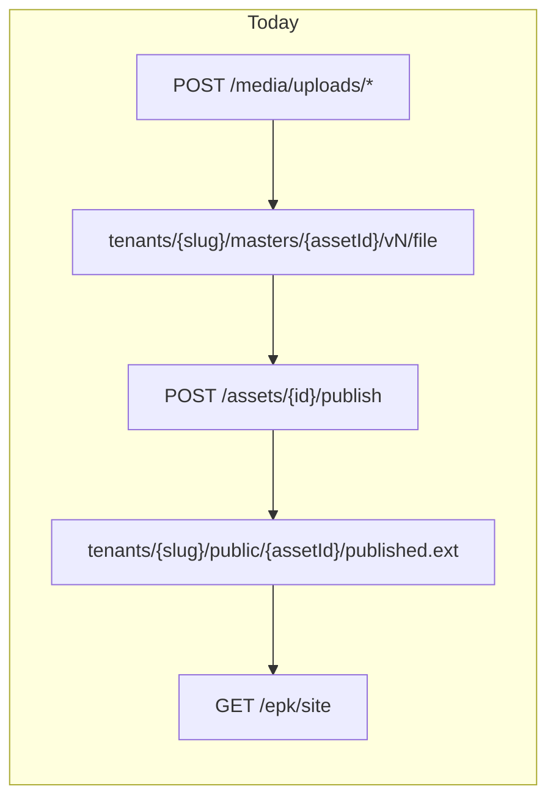
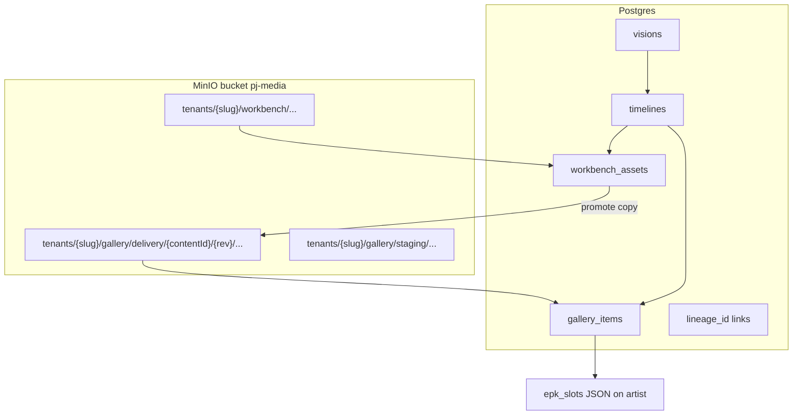

# c0ll3ct1v3 Media Platform Roadmap

Living planning doc for workbench/gallery infrastructure, metadata, public EPK, engagement, and agentic manager.

---

## Product north star

| Surface | URL (target) | Audience | Purpose |
|---------|----------------|----------|---------|
| **Workbench** (internal) | `{artist}.c0ll3ct1v3.xyz` | Artist + agents | Upload, edit, develop, promote to gallery |
| **Public EPK** (external) | `c0ll3ct1v3.xyz/{artist}` | Bookers (hybrid fan page later) | Hero video + photos + bio; fast updates |
| **Gallery staging** (optional sub-zone) | Same bucket, `gallery/staging/` | Client screening | Pre-public review inside gallery rules |

**v1 EPK content:** YouTube hero embed + gallery photos + bio (simple template, not Design Studio). Worst failure = slow curation; prefer **fixed layout + slot swaps** (“replace EPK video with asset X”).

**Deferred (explicit):** Audience auto-on-upload, Design Studio LLM layout, Plaid/payments, multi-channel inbox (DMs/Telegram), Hermes fork, blockchain/self-hosted video, external public API, engagement-driven automation.

---

## Current state (baseline)



- Single MinIO bucket (`pj-media`), keys in `backend/app/api/media/router.py`: `masters/` on upload, `public/` on publish.
- One table model: `MediaAsset` with `status` (`inbox` → `processing` → `ready` → `published`) and JSON `tags`.
- Public reads: `backend/app/api/epk/router.py` + `epk_media_resolve.py`.
- Transcodes/derivatives: `media-worker` + `MediaVariant` (never should live under workbench).

---

## Target architecture



### Object key conventions (one bucket, hard prefixes)

| Zone | Prefix pattern | Writable by | Notes |
|------|----------------|-------------|-------|
| **Workbench** | `tenants/{slug}/workbench/{assetId}/v{n}/{filename}` | Portal upload, ingest worker | Raw masters, stems, drafts; **no public ACL** |
| **Gallery delivery** | `tenants/{slug}/gallery/delivery/{contentId}/r{rev}/{filename}` | Promotion job only | **Immutable revisions** — new public URL only when `rev` increments |
| **Gallery staging** | `tenants/{slug}/gallery/staging/{contentId}/r{rev}/...` | Promotion (staging flag) | Same copy rules; not linked from public EPK until “released” |

**Barriers:**
- Upload init validates prefix starts with `workbench/` (reject `gallery/` writes from client).
- Public EPK resolver only reads `gallery/delivery/` (and staging only for authenticated preview routes).
- IAM/policy (later on AWS): prefix-scoped credentials for worker roles.

**Immutability:** Never overwrite `r{n}` objects; EPK slot points to `{contentId, rev}`. “Replace hero video” = new gallery item or new rev + update slot pointer.

**Both assets persist:** Promotion is **copy** (workbench master remains). `lineage_id` ties workbench row → gallery row.

### Derivatives glossary

| Kind | Examples | Lives in |
|------|----------|----------|
| **Master** | WAV, ProRes, full-res JPEG | Workbench only |
| **Delivery** | Published MP3, web JPEG, “published.ext” | Gallery `delivery/` |
| **Derived** | Thumbnail, web transcode, waveform, HLS segments | Gallery `delivery/.../derived/` (or sibling keys under same `contentId/rev`) |

Ingest worker (`worker_tasks.py`) runs on workbench upload; on promote, optionally generate delivery derivatives into gallery paths only.

---

## Phase 1 — Workbench / gallery split (priority)

**Goal:** Correct storage layout + API guardrails without full Vision/Timeline schema yet.

### 1.1 Storage layer

- Add `backend/app/services/storage_paths.py`: `workbench_master_key()`, `gallery_delivery_key()`, `gallery_staging_key()`, `assert_workbench_key()`, `assert_gallery_key()`.
- Change upload init in `media/router.py`: `masters/` → `workbench/`.
- Change publish/promote: `public/` → `gallery/delivery/{contentId}/r1/...` (use `asset.id` as interim `contentId` until Phase 2).
- Migration script: copy existing `tenants/*/masters/*` → `workbench/`, `public/*` → `gallery/delivery/` (or dual-read fallback for 30 days).

### 1.2 Data model (minimal)

Extend `MediaAsset` (or add columns via migration):

- `storage_region`: `workbench` | `gallery` (enum)
- `gallery_rev`: integer, default 1 for delivery objects
- `parent_asset_id`: nullable FK for lineage (workbench → gallery copy)
- `epk_role`: nullable enum later (`hero_video_ref`, `photo`, `audio`) — optional in 1.2

Replace overloaded `status=published` semantics: workbench assets stay `ready`; gallery items use `visibility` + `gallery_stage` (`staging` | `released`).

### 1.3 API changes (internal)

| Endpoint | Change |
|----------|--------|
| `POST /media/uploads/init` | Target `workbench/` only |
| `POST /media/assets/{id}/promote` | Rename/refactor `publish`; copy to `gallery/delivery/` or `gallery/staging/`; set `parent_asset_id` |
| `GET /media/assets` | Filter `?region=workbench|gallery` |
| `GET /media/assets/{id}/preview-url` | Workbench = presigned; gallery released = stable CDN/public URL |

Update `epk_media_resolve.py` path checks: `/public/` → `/gallery/delivery/`.

### 1.4 Portal UX (thin)

- Library tabs: **Workbench** | **Gallery** (and optional **Staging** filter).
- Actions: “Promote to gallery (staging)” / “Release to public EPK pool”.
- Remove dependency on Design Studio for day-to-day flows.

### 1.5 Infra

- `docker-compose.dev.yml`: document bucket layout in comments.
- Worker: ingest reads workbench keys; derivative output paths under gallery only when job type `promote_derivatives`.

**Exit criteria:** New uploads land only under `workbench/`; promotion creates immutable gallery keys; public EPK still resolves media (via migration or dual-read).

---

## Phase 2 — Metadata: Vision / timeline / lineage

**Goal:** Model “archetypal vision” — one song with dev versions, release, alt release under one umbrella.

### 2.1 New tables (separate from monolithic `media_assets`)

```text
visions
  id, tenant_slug, title, vision_type (song|campaign|film|...), created_at

timelines
  id, vision_id, label (e.g. "Release", "Alt mix", "EPK cut"), sort_order

workbench_assets
  id, timeline_id, storage_key, mime, asset_type, provenance JSON, ...

gallery_items
  id, timeline_id, lineage_id (→ workbench_assets.id), content_id, rev,
  storage_key, gallery_stage (staging|released), immutable_url_slug, ...

provenance (JSON on rows or table)
  source: upload|agent|export_tool, parent_id, agent_run_id, created_by
```

- **lineage_id:** gallery item → workbench asset that produced it.
- **content_id:** stable id across revs (EPK links to content_id + rev).
- DaVinci analogy: **Vision** = project; **Timeline** = timeline/version lane; **clips** = workbench/gallery rows.

### 2.2 API (REST, internal)

- `CRUD /visions`, `/visions/{id}/timelines`
- `POST /timelines/{id}/workbench/upload` (wraps existing multipart)
- `POST /workbench/{id}/promote` → creates `gallery_items` row + copy
- `GET /gallery?stage=released|staging`

**Rights:** Not a boolean column — enforce via **promotion pipeline**: only items passing `gallery_stage=released` are eligible for EPK slot binding (systematic gate).

### 2.3 Metadata detail

Mark for thoughtful pass: audio features, genre, BPM, audience_map refs, campaign tags. Store in `metadata JSONB` on timeline or gallery item until shapes stabilize.

---

## Phase 3 — Public EPK (booker-first)

**Goal:** `c0ll3ct1v3.xyz/{artist}` — simple template, fast slot updates.

### 3.1 EPK config schema (on `Artist.epk_config`)

```json
{
  "epk_public": {
    "template": "booker_v1",
    "hero_video": { "type": "youtube", "url": "https://..." },
    "photos": [{ "gallery_content_id": "...", "rev": 1 }],
    "bio": "...",
    "booking_email": "..."
  }
}
```

- **Swap command:** `PATCH /artists/me/epk-public` with `{ "hero_video": { "gallery_content_id": "..." } }` or agent skill equivalent.
- Server validates: referenced gallery items exist, `gallery_stage=released`, tenant matches.

### 3.2 Public frontend

- New route: `/a/:artistSlug` (or host-based routing to same component).
- Fetch `GET /epk/public/{slug}` — no auth; returns template + resolved URLs (photos from MinIO delivery keys; video = YouTube iframe).
- **Future self-host:** reserve `hero_video.type: "gallery"` pointing at `immutable_url_slug`; CDN in front of MinIO.

### 3.3 Hybrid fan page

- Same data model; alternate template `fan_v1` later (cozier copy, more photos). Booker template stays default.

### 3.4 DNS (ops note)

- `*.c0ll3ct1v3.xyz` → portal (Auth0)
- `c0ll3ct1v3.xyz/{artist}` → public EPK static/SSR

---

## Phase 4 — Engagement (data only)

**Goal:** Industry-standard metrics, anonymous-first, no automation yet.

### 4.1 Tables

```text
engagement_events
  id, tenant_slug, event_type (view|play|click|share|download),
  target_type (epk|gallery_item|outbound_link), target_id,
  session_id (anon cookie), referrer, user_agent, created_at
```

- EPK page: lightweight JS beacon or server-side log on `GET /epk/public` + play/click endpoints.
- **Later:** Spotify/IG APIs — separate ingest tables.

### 4.2 Reporting API (internal)

- `GET /analytics/epk/summary?period=30d` — views, CTR, top outbound links.

---

## Phase 5 — Agentic manager (Hermes, later)

- Hermes skills call internal API (`promote`, `epk-public` patch, vision CRUD).
- **Email inbox first**; DMs/Telegram/Discord queued.
- **Plaid / payments:** read `docs/finance-compliance/` before implementation; biometric confirmation = future gate on write actions.
- **Video self-host / decentralized:** research spike only; not on critical path.

---

## What to trim now (reduce bloat)

| Area | Action |
|------|--------|
| Design Studio LLM layout | Freeze; EPK uses `booker_v1` slots |
| Audience tab | Keep manual analyze; no upload hook |
| `epk_config.design_*` | Deprecate gradually after `epk_public` ships |
| Duplicate publish paths | Single `promote` pipeline into gallery |

---

## Suggested implementation order

1. **Phase 1.1–1.3** — paths, promote API, dual-read migration, epk resolver update
2. **Phase 1.4** — portal Workbench/Gallery tabs
3. **Phase 2** — vision/timeline tables + lineage
4. **Phase 3** — public EPK template + slot swap API
5. **Phase 4** — engagement_events + basic dashboard
6. **Phase 5** — Hermes skills + email; Plaid when compliance ready

---

## Open questions (resolve during Phase 2 design)

- **content_id** vs reusing `asset.id` for gallery revs — recommend new UUID at first promote, stable across revs.
- **Gallery staging** ACL: presigned-only vs password link for clients.
- **YouTube vs gallery video slot:** EPK v1 YouTube only; schema supports both.

---

## Success metrics

- Zero workbench objects served on public EPK URLs.
- Promoting a track does not delete workbench master.
- Replacing EPK hero video is one API call / agent command, under 5s perceived latency.
- New artist onboarded with only workbench upload → promote → EPK live without touching Design Studio.
